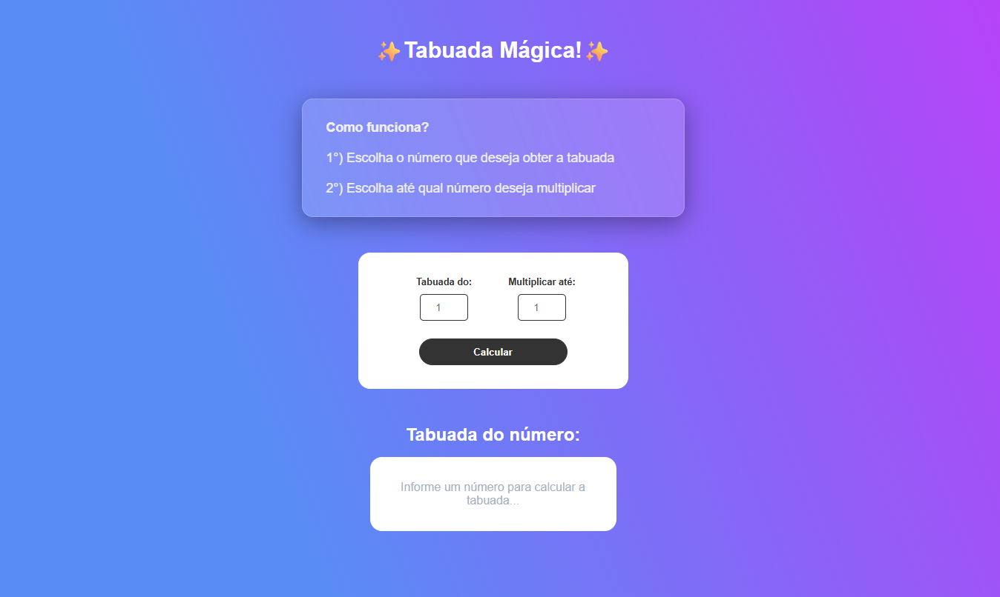

# ✨ Tabuada Mágica - Multiplicação Divertida! ✨

  📐 Entre no mundo encantado da matemática e descubra o poder das tabuadas com estilo! 🌈

Este projeto é uma aplicação web interativa onde você pode gerar tabuadas de forma simples, visual e responsiva. Ideal para crianças, estudantes e qualquer pessoa que deseje treinar a multiplicação de um jeito leve e colorido. 💫

---

## 📸 Prévia do Projeto

  

---

### 🔗 Versão Online:
👉 [Acesse aqui o projeto publicado](https://multiplication-table-liart.vercel.app/)

---

## 🛠️ Tecnologias Utilizadas

Este projeto foi construído com as tecnologias:

- 
- 
- 

---

## 📚 Como Funciona?

1. Digite o número desejado para calcular a tabuada.
2. Escolha até qual número você quer multiplicar.
3. Clique em **Calcular** e veja a mágica acontecer! ✨

Tudo isso com um design moderno, acessível e responsivo, pensado para facilitar a compreensão.

---

## 🎯 Funcionalidades

- ✅ Geração dinâmica da tabuada com JavaScript puro
- ✅ Design visual com **efeito vidro**, cores vibrantes e emojis ✨
- ✅ Campos de entrada validados
- ✅ Layout centralizado e responsivo
- ✅ Código limpo, didático e ideal para estudos

---

Este projeto encantado foi desenvolvido por:
👩‍💻 Laura Serbêto — 
